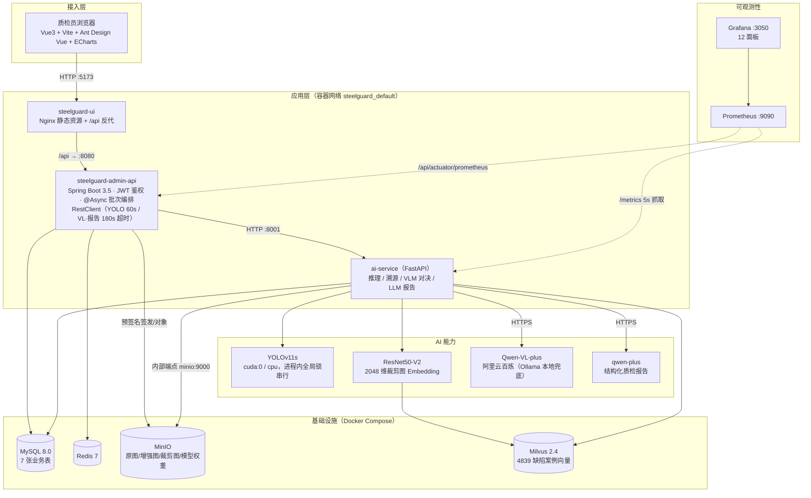
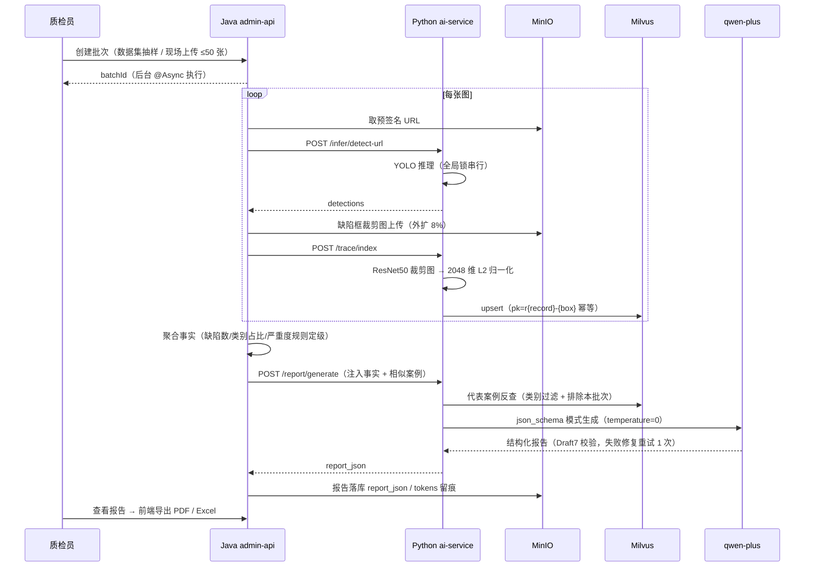

# SteelGuard — AI 钢材表面缺陷智能质检平台

> 面向钢铁产线的端到端 AI 质检系统：**YOLOv11s 实时缺陷检测 + Qwen-VL 零样本对照 + Milvus 相似缺陷溯源 + LLM 结构化质检报告**，覆盖「数据工程 → 模型训练评估 → 推理服务化 → 业务闭环 → 容器化与可观测性」全链路。

[](#技术栈)
[](#数据集)
[](#模型效果)
[](#性能压测)
[](#二docker-一键启动gpu--cpu)

---

## 目录

1. [项目背景与目标](#一项目背景与目标)
2. [核心亮点](#二核心亮点)
3. [系统架构](#三系统架构)
4. [技术栈](#四技术栈)
5. [快速开始](#五快速开始)
6. [项目结构](#六项目结构)
7. [性能压测](#七性能压测)
8. [模型效果与零样本对决](#八模型效果与零样本对决)
9. [监控与可观测性](#九监控与可观测性)
10. [数据集与训练复现](#十数据集与训练复现)
11. [测试](#十一测试)
12. [文档索引](#十二文档索引)

---

## 一、项目背景与目标

人工目视检测钢材表面裂纹、夹杂、划痕等缺陷成本高、一致性差。本项目基于东北大学 **NEU-DET** 钢材表面缺陷公开数据集（1800 张、6 类缺陷），构建了一条可落地的工业 AI 质检流水线，并针对落地必答题给出实测答案：

- **专用小模型 vs 通用多模态大模型怎么选？** —— 同 100 张验证集实测 YOLO 与 Qwen-VL 的 F1 / 延迟 / 成本；
- **检测完之后呢？** —— 检出框入 Milvus 做相似历史缺陷溯源，LLM 基于程序聚合事实生成结构化质检报告并导出 PDF/Excel；
- **线上扛得住吗？** —— 全栈容器化 + Prometheus/Grafana 监控，阶梯压测给出容量边界（20 并发 P95 446.6ms、0 错误）。

## 二、核心亮点

1. **全栈自研，不只是调模型**：Java 微服务网关（JWT、异步批次编排、MinIO 双端点预签名）+ Python AI 服务（YOLO/Embedding/VLM/LLM）+ Vue3 可视化，MySQL / Redis / MinIO / Milvus 完整工程化。
2. **YOLO vs VLM 百图实测对照**（非纸上谈兵）：YOLO F1=0.677、单图 11.9ms、零现金成本；Qwen-VL-plus 零样本 F1=0.034、均 8.5s、¥0.167/100 张 —— 用数据说明工业产线为何应选专用检测模型。
3. **LLM 防幻觉三重防线**：事实注入（所有数字由 Java 聚合，禁止 LLM 造数）+ JSON Schema 强校验 + 校验失败带错修复重试，脏报告绝不落库；严重度由程序规则最终定级并留痕。
4. **Milvus 缺陷溯源**：ResNet50-V2 对检测框裁剪图提 2048 维特征入库（4839 个历史案例），bbox 模式 top1 同类率 **93.3%**；支持类别过滤与排除本批次。
5. **GPU/CPU 双模式容器化**：一份 Dockerfile 构建 GPU(4.53GB)/CPU(1.05GB) 镜像，`docker compose --profile gpu|cpu up` 一键起；MySQL 空卷自动建表 + admin 种子。
6. **可观测性达标**：Prometheus 5 秒抓取 Python/Java 双端自定义指标，Grafana 12 面板自动预置；阶梯压测定位到全局串行锁为容量瓶颈并给出扩容方向。
7. **121 个 Python 测试全绿**，覆盖增强变换、VLM JSON 打捞、报告校验、Milvus 表达式白名单注入防护等真实踩坑点。

## 三、系统架构



**核心业务链路（创建质检批次 → 溯源 → 报告）：**



## 四、技术栈

| 层 | 技术 | 说明 |
|---|---|---|
| 前端 | Vue 3 + TypeScript + Vite + Ant Design Vue + ECharts + Pinia | 画布画框/DPR 适配、html2canvas-pro+jsPDF 导出 PDF、SheetJS 导出 Excel |
| 网关/业务 | Java 17（Maven 多模块）、Spring Boot 3.5、Spring Security + JWT、MyBatis | admin-api + common 两模块；Actuator + Micrometer 指标 |
| AI 服务 | Python ≥3.10、FastAPI、Uvicorn、PyTorch 2.14（cu126/cpu 双 wheel） | Ultralytics YOLOv11、ONNX Runtime、torchvision |
| 多模态/LLM | 阿里云百炼 qwen-vl-plus / qwen-plus（OpenAI 兼容协议） | DASHSCOPE Key 可选；未配置时相关功能降级，不影响主链路；Ollama 兜底 |
| 存储/检索 | MySQL 8.0、Redis 7、MinIO（S3）、Milvus 2.4 standalone（etcd） | 向量：FLAT + COSINE，2048 维 |
| 可观测 | Prometheus 2.54、Grafana 11.3、Micrometer、prometheus-fastapi-instrumentator | 5s 抓取，12 面板 provisioning |
| 部署 | Docker Compose（gpu/cpu 互斥 profile）、Nginx 1.27 | GPU 镜像 4.53GB / CPU 镜像 1.05GB |

## 五、快速开始

### （一）前置条件

- Docker Desktop（集成 Docker Compose v2）；GPU 模式需本机 NVIDIA 显卡 + 最新驱动 + `nvidia-smi` 可用
- 端口空闲：5173 / 8080 / 8001 / 9090 / 3050 / 4406 / 6379 / 9000 / 9001 / 19530（可在根目录 `.env` 修改）

> Windows 注意：3000 端口常落入 Hyper-V 保留段（2940–3039），Grafana 已改用 **3050**。

### （二）Docker 一键启动（GPU / CPU）

```bash
# GPU 模式（推荐，RTX 4060 Laptop 实测）
docker compose --profile gpu up -d --build

# CPU 模式（任意机器，推理约 156ms/图，适合无显卡机器演示主流程）
docker compose --profile cpu up -d --build

# 只起基础设施（本地三进程开发时用）
docker compose up -d
```

首次启动 MySQL 空卷自动执行建表脚本 + admin 种子。启动后：

| 服务 | 地址 | 凭据 |
|---|---|---|
| 前端（Nginx） | http://localhost:5173 | admin / admin123 |
| 后端 API + Swagger | http://localhost:8080/api/doc.html | JWT 登录后访问 |
| AI 服务健康检查 | http://localhost:8001/health | — |
| Prometheus | http://localhost:9090 | — |
| Grafana（看板自动预置） | http://localhost:3050 | admin / admin（首登可 Skip 改密） |
| MinIO Console | http://localhost:9001 | steelguard / steelguard123 |

> 可选：在根 `.env` 配置 `DASHSCOPE_API_KEY=...` 启用 VLM 对决与 LLM 报告；不配则这两项提示未配置，YOLO 检测/批次/溯源均不受影响。
> Linux 原生 Docker 需把 `.env` 的 `MINIO_PUBLIC_ENDPOINT` 改为宿主 IP（浏览器要能访问到 MinIO 预签名 URL）。

### （三）本地开发模式

```bash
# 1) 基础设施
docker compose up -d

# 2) Java 后端（JDK 17+、Maven 3.9+）
cd steelguard-backend
mvn clean package -DskipTests
java -jar steelguard-admin-api/target/steelguard-admin-api.jar

# 3) Python AI 服务（推荐 uv；Python 3.10–3.14 均可）
cd ai-service
uv sync                       # GPU 机器 torch 需 cu126 wheel，见交接文档 5.6
.\.venv\Scripts\python.exe -m uvicorn app.main:app --host 0.0.0.0 --port 8001

# 4) 前端
cd steelguard-ui
npm install
npm run dev
```

模型权重 `ai-service/weights/best.pt`（18.3MB）与 ResNet50 缓存不入库，获取方式见[数据集与训练复现](#十数据集与训练复现)。

## 六、项目结构

```
steelguard/
├── docker-compose.yml            # 全栈编排（gpu/cpu 互斥 profile）
├── .env                          # 端口/端点配置（Key 走环境变量勿提交）
├── docker/
│   ├── backend.Dockerfile        # Maven 多阶段构建 → JRE 瘦镜像
│   ├── mysql-init/               # admin BCrypt 种子
│   ├── prometheus/prometheus.yml # 双 job 5s 抓取
│   └── grafana/                  # datasource + 12 面板自动 provisioning
├── steelguard-backend/           # Java 17 + Spring Boot 3.5（Maven 多模块）
│   ├── steelguard-common/        # 通用响应/异常/分页
│   └── steelguard-admin-api/
│       └── src/main/java/com/steelguard/admin/
│           ├── security/         # JWT 过滤器/Spring Security 配置
│           ├── dataset/          # 数据集版本/图像/标注管理
│           ├── inference/        # YOLO / VLM 推理网关（多 RestClient 超时分级）
│           ├── inspection/       # 批次异步编排、报告生成、溯源代理
│           └── user/
├── ai-service/                   # Python FastAPI AI 服务
│   ├── app/
│   │   ├── inference/            # yolo_infer / vl_infer / ONNX 校验
│   │   ├── trace/                # embedder(ResNet50) / Milvus 索引检索
│   │   ├── report/               # 事实注入报告 builder / Schema 校验 / 打捞解析
│   │   ├── dataset/              # VOC 解析/增强/EDA/YOLO 导出/MinIO
│   │   ├── metrics.py            # Prometheus 自定义指标
│   │   └── config.py
│   ├── scripts/                  # 压测、VLM 批量对决、历史库索引脚本
│   ├── training/train_neudet.sh  # AutoDL 训练复现脚本
│   ├── tests/                    # 121 个 pytest
│   └── Dockerfile                # GPU/CPU 共用，ARG 切 wheel 源
├── steelguard-ui/src/
│   ├── layouts/BasicLayout.vue
│   └── views/
│       ├── Dashboard.vue         # 总览
│       ├── dataset/Dataset.vue   # EDA 看板（版本/类别/框尺寸分布）
│       ├── inference/Infer.vue   # YOLO/VLM 双模型对决画布
│       └── inspection/           # 批次列表、报告详情、缺陷趋势
└── docs/                         # 方案/交接/训练与对决报告/演示脚本/截图
```

## 七、性能压测

全链路阶梯压测（**客户端 → Nginx → Java/JWT → Python YOLO**，multipart 上传，200 张 NEU-DET 图片内存池轮换，每档 500 请求，4 并发 30 请求预热）：

| 并发 | QPS | P50 | P95 | P99 | 错误 | 结论 |
|---:|---:|---:|---:|---:|---:|---|
| 10 | 58.0 | 144.8ms | 199.5ms | 271.9ms | 0 | 余量充足 |
| **20** | 55.2 | 321.9ms | **446.6ms** | 504.3ms | **0** | ✅ **达标（验收线 P95<800ms 且 0 错误）** |
| 50 | 55.1 | 803.6ms | 1119.8ms | 1144.6ms | 0 | 容量拐点：排队等锁，非推理变慢 |

- 单机环境：Ryzen 7 7840H / RTX 4060 Laptop 8GB；单请求 GPU 纯推理仅 12–15ms，CPU（onnxruntime）约 156ms/图。
- **瓶颈分析**：`YoloInferencer` 进程内全局锁保证同卡串行，QPS 天花板约 55–58（图片解码 + 网络跳数 + GIL 占用了理论 80 QPS 之外的预算）；50 档延迟随并发近似线性抬升，符合 Little's law。
- **扩容路径**：多请求 batch 合并推理 → 多 GPU 副本 + 轮询 → ONNX/TensorRT；脚本可复现：`ai-service/scripts/load_test_detect.py`，报告输出到 `ai-service/reports/`。

## 八、模型效果与零样本对决

**YOLOv11s 训练（NEU-DET 分层 7200/360，120 epoch + patience 30，78 epoch 早停）：**

| 指标 | mAP50 | mAP50-95 | Precision | Recall |
|---|---|---|---|---|
| 全类 | **0.760**（验收 ≥0.70） | 0.429 | 0.733 | 0.715 |

分类别 mAP50：scratches 0.959 / patches 0.935 / inclusion 0.878 / pitted_surface 0.822 / rolled-in_scale 0.600 / crazing 0.365（裂纹细长低对比，已知短板，改进方向 yolo11m + 过采样）。

**百图零样本对决（val 集 seed42 分层抽 100，IoU 0.5）：**

| 方案 | F1 | 主类（patches） | 单图延迟 | 现金成本（100 张） |
|---|---|---|---|---|
| **YOLOv11s（本地 GPU）** | **0.677** | **0.98** | **11.9ms**（P95 13.7ms） | **¥0** |
| Qwen-VL-plus 零样本 | 0.034 | 0.34 | 均 8.5s（P95 33.3s） | ¥0.167（约 12.8 万 token） |

工程要点：VLM 长 JSON 输出会在完整对象后重复片段并半截断尾（finish_reason 仍报 stop），项目实现代码围栏/尾随逗号容忍 + 括号深度扫描打捞 + 输出限框/限 token 三重防线，批处理失败率 **23% → 0%**。详见 [QwenVL零样本对决报告.md](docs/QwenVL零样本对决报告.md)。

## 九、监控与可观测性

- **Python 自定义指标**：`yolo_inference_duration_seconds`（device/result 标签直方图）、`yolo_detections_total`（按缺陷类）、`yolo_detection_confidence`（置信度分布）、`yolo_model_info`；端点 `:8001/metrics`。
- **Java 指标**：`http.server.requests` 百分位直方图（按 URI/status）、JVM 堆/CPU、Tomcat 线程；端点 `:8080/api/actuator/prometheus`（仅暴露 health/info/prometheus/metrics）。
- **Grafana 12 面板**：AI QPS、P50/P95/P99（标注 800ms 验收线）、6 类检出速率、置信度中位数、AI 错误率、Java 推理网关 P95、全接口 P95、QPS、状态码、JVM 堆、进程 CPU、Tomcat 线程；数据源与看板均文件 provisioning，开箱即有。

## 十、数据集与训练复现

- **NEU-DET**：1800 张 200×200 灰度图、6 类各 300（crazing / inclusion / patches / pitted_surface / rolled_in_scale / scratches）、4189 个 PascalVOC 框，平均 2.33 框/图；数据不入 Git，自动下载/合并/导入流程见交接文档。
- **数据工程**：Albumentations 几何/光度增强（v1-aug5 版本 7200 张增强图，bbox 同步变换 + min_visibility 过滤碎片框），YOLO 导出分层 8:2（增强副本不跨集合防泄漏）。
- **训练**：`ai-service/training/train_neudet.sh`（AutoDL 4090 约 0.56h）；产物归档 MinIO `models/neu-det/yolo11s/best.pt`，训练曲线见 [YOLOv11s训练记录报告.md](docs/YOLOv11s训练记录报告.md)。
- **ONNX 一致性**：opset12 导出 36MB，12 张抽样 PT(GPU) vs ONNX(CPU) 框数一致、IoU≥0.95、置信差≤0.03。
- **历史案例库**：1800 原图全量过模型 → 1777 张含缺陷、**4839 个案例**入 Milvus，MySQL/Milvus/MinIO 三端计数一致。

## 十一、测试

```bash
# Python（注意：直接用 venv 的 pytest，uv run 会触发 grpcio 源码编译）
cd ai-service
.\.venv\Scripts\python.exe -m pytest -q      # 121 passed
```

覆盖：VOC 解析/重复框去重、增强碎片框回归、YOLO 导出分层防泄漏、推理契约（FakeTensor）、VLM JSON 打捞 5 例、报告 Schema 校验与防幻觉白名单、Embedding 裁剪/L2、Milvus pk 与类别表达式注入白名单等。

## 十二、文档索引

| 文档 | 内容 |
|---|---|
| [docs/项目方案文档.md](docs/项目方案文档.md) | 立项调研、6 阶段方案、面试考点映射 |
| [docs/项目交接文档.md](docs/项目交接文档.md) | 环境准备、各阶段验收清单、踩坑与恢复步骤 |
| [docs/YOLOv11s训练记录报告.md](docs/YOLOv11s训练记录报告.md) | 训练超参、mAP/PR/混淆矩阵 |
| [docs/QwenVL零样本对决报告.md](docs/QwenVL零样本对决报告.md) | 百图对决方法、数据、失败形态分析 |
| [docs/演示视频脚本.md](docs/演示视频脚本.md) | 求职演示分镜与解说词 |
| `ai-service/reports/` | 压测报告、VLM 对决原始 JSON/CSV |
| `docs/screenshots/` | 推理画框与双模型对决验收截图 |

---

### Roadmap（已识别、未实施）

- crazing 类别专项优化（yolo11m / 类别过采样 / 去掉黑边 rotate）
- 推理扩容：batch 合并、多 GPU 副本、TensorRT
- 混合检索（向量 + 元数据/全文）、实验追踪（MLflow）
